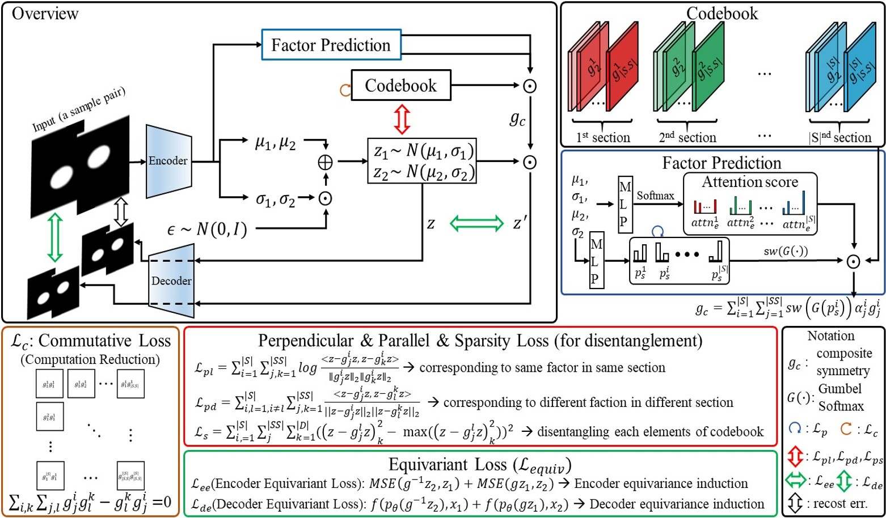
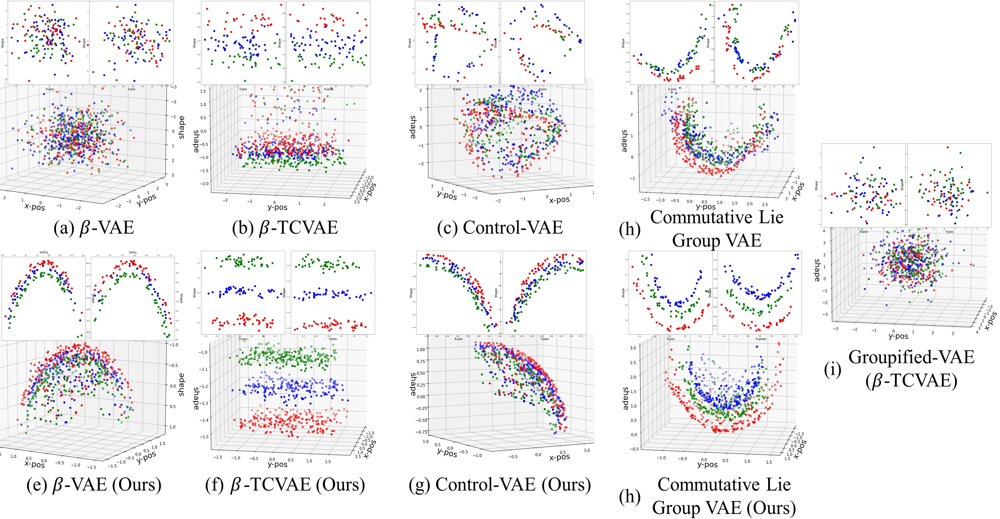
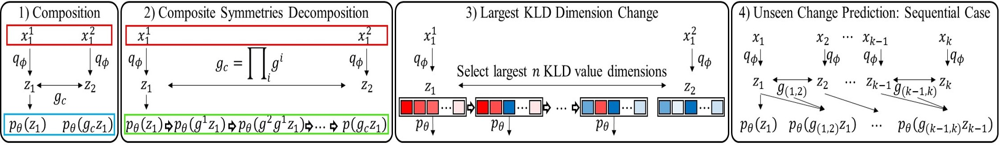
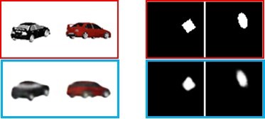
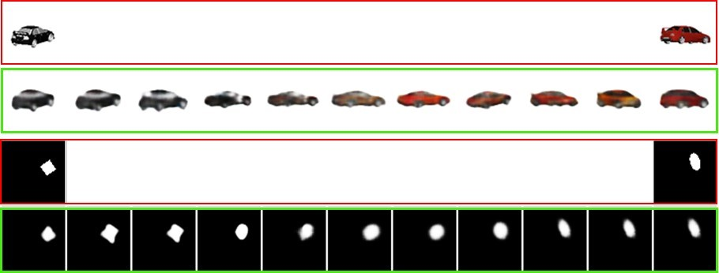
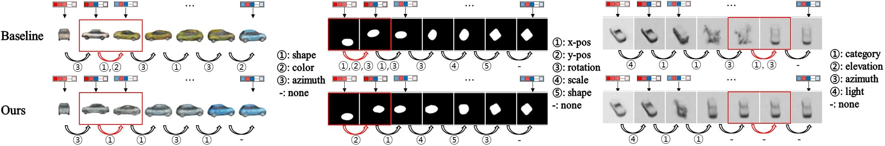
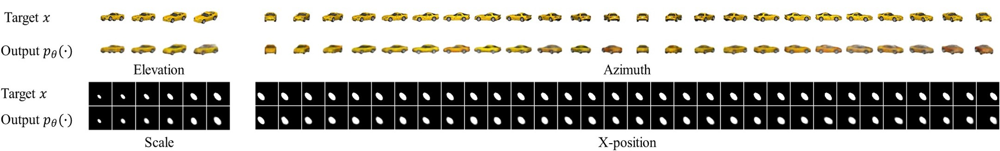

# CFASL: Composite Factor-Aligned Symmetry Learning for Disentanglement in Variational AutoEncoder

This repository is the official implementation of CFASL: Composite Factor-Aligned Symmetry Learning for Disentanglement in Variational AutoEncoder

## Abstract

Implemented symmetries of input and latent vectors is important for disentanglement learning in VAEs, but most works focus on disentangling each factor without consideration of multi-factor change close to real world transformation between two samples, and even a few studies to handle it in autoencoder literature are constrained to pre-defined factors.
We propose a novel disentanglement framework for Composite Factor-Aligned Symmetry Learning (CFASL) on VAEs for the extension to general multi-factor change condition without constraint. 
CFASL disentangles representations by 1) aligning their changes, explicit symmetries, and unknown factors via proposed inductive bias, 2) building a composite symmetry for multi-factor change between two samples, and 3) inducing group equivariant encoder and decoder in the condition. To set up the multi-factor change condition, we propose sample pairing for inputs, and an extended evaluation metric.
In quantitative and in-depth qualitative analysis, CFASL shows significant improvement of disentanglement in multi-factor change condition compared to state-of-the-art methods and also gradually improves in single factor change condition on common benchmarks.

## General Settings
We set the below settings for all experiments in

**3D Cars & smallNORB**

* GPUs: NVIDIA GeForce RTX 2080 Ti x 1

**dSprites & 3D Shapes & CelebA**

* GPUs: NVIDIA GeForce RTX 3090 x 1

## Requirements

To create the environment:
    
    # cfasl.yaml file is in setup folder
    conda env create -f $DIR$/cfasl.yaml
    

#### Folders and Files
    .
    |--- configs
    |   |--- config.py                       # Model Configures (CFASL)
    |   |--- utils.py                        # Model Configures (baeslines)
    |
    |--- dataset
    |   |--- car.py                          # 3D Cars dataset loader
    |   |--- celebA.py                       # CelebA dataset loader
    |   |--- dsprites.py                     # dSprites dataset loader
    |   |--- shapes3d.py                     # shapes3d dataset loader
    |   |--- smallnorb.py                    # smallNORB dataset loader
    |   |--- utils.py                        # dataset loader
    |
    |--- model
    |   |--- betatvae.py                     # beta-TCVAE model
    |   |--- betavae.py                      # beta-VAE model
    |   |--- commutativevae.py               # Commutative Lie Group VAE model
    |   |--- controlvae.py                   # Control-VAE model
    |   |--- decoder                         # VAE decoders
    |   |--- encoder.py                      # VAE encoders
    |   |--- group_action_layer.py           # CFASL layer
    |   |--- groupbetatcvae.py               # beta-TCVAE model (CFASL)
    |   |--- groupbetavae.py                 # beta-VAE model (CFASL)
    |   |--- groupcommutativevae.py          # Commutative Lie Group VAE model (CFASL)
    |   |--- groupcontrolvae.py              # Control-VAE model (CFASL)
    |   |--- utils.py  
    | 
    |--- src
    |   |---3dplots
    |   |   |---plots.ipynb                  # Run 3D-polts from pickle files
    |   |
    |   |--- analysis_tools
    |   |   |--- common_quali.py             # -2 +2 qualitative analysis
    |   |   |--- eigen.py                    # extract eigen vector and value of latent vector space
    |   |   |--- largest_kld.py              # Lagest KLD Dimension Change (Figure 5-a)
    |   |   |--- plots.py                    # 3D-plots (Figure 1)
    |   |   |--- symmetries.py               # Other Qualitative Analysis (Figure 5-a)
    |   |   |--- utils.py
    |   |
    |   |--- disent_metrics                  
    |   |   |--- betavae.py                  
    |   |   |--- dci.py 
    |   |   |--- eval.py 
    |   |   |--- fvm.py 
    |   |   |--- mfvm.py                     # proposed metric
    |   |   |--- mig.py 
    |   |   |--- sap.py 
    |   |   |--- utils.py 
    |   |
    |   |--- train                  
    |   |   |--- evaluation.py               # model evaluation
    |   |   |--- training.py                 # model training
    |   |
    |   |--- constants.py
    |   |--- files.py                        # build model saving directory
    |   |--- info.py                         # wirte results to csv
    |   |--- optimizer.py   
    |   |--- seed.py 
    |   |--- utils.py             
    |
    |--- main.py                             # model run

## Datasets

 **dSprites**:
 Download dsprites_ndarray_co1sh3sc6or40x32y32_64x64.npz from [here](https://github.com/deepmind/dsprites-dataset).
 
 **3D Shapes**:
 Download 3dshapes.h5 file from [here](https://github.com/deepmind/3d-shapes).
 
 **3D Cars**: 
 Download this dataset in [here](http://www.scottreed.info/), Deep Visual Analogy-Making [Data].
 
 **smallNORB** & **CelebA**:
 Download the datasets from the ./dataaset/{smallnorb.py & celebA.py}
 
 
 
## Training

Set {DATA_DIR} as

* dSprites: {data dir}/{filename}

* 3D Cars: {data dir}

* smallNORB: {data dir}

* 3D Shapes: {data dir} (we transform the h5 file to images)

# Model Training and Evaluation

    #!/bin/sh
    trap "exit" INT
    CUDA_VISIBLE_DEVICES={DEVICE_IDX} python {FILE DIR}/main.py \
    --device_idx {RDEVICE_IDX} \
    --dataset CHOOSE ONE OF THEM: {dsprites, shapes3d, car, smallnorb}\
    --data_dir {DATA_DI}$ \
    --output_dir {CHECKPOINT DIR} \
    --run_file {TENSORBOSRD RUNFILE DIR} \
    --project_name {WADNB PROJECT_NAME} \
    --model_type CHOOSE ONE OF THEM: {betavae, betatcvae, controlvae, commutativevae, cfasl_betavae, cfasl_betatcvae, cfasl_controlvae, cfasl_commutativevae} \
    --latent_dim {6 (3D Shapes), 10 (Others)} \
    --split 0.0 \
    --per_gpu_train_batch_size 64 \
    --test_batch_size 64 \
    --num_epoch 0 \
    --max_steps {1,000,000 (CelebA), 500,000 (3D Shapes), 300,000 (Others)} \
    --save_steps {SAVE_STEPS} \ # set as large neumber {1e+9}
    --patience {PATIENCE} \ # set as large neumber {1e+9}
    --optimizer adam \
    --seed {1,2,3,4,5,6,7,8,9,10} \
    --lr_rate 1e-4 \
    --weight_decay 0.0 \
    --alpha 1.0\
    --gamma 1.0 \
    --lamb 1.0 \
    --quali_sampling {EQUAL TO latent_dim} \
    --do_mfvm --do_train --do_eval --write 
    Common Hyper-Parameter Settings
    --sub_sec {16 (3D Shapes), 10 (Others) } \
    --epsilon {0.1 0.01} \
    --th {0.2 0.5} \
    IF BETA-VAE or -TCVAE
    --beta {1.0 2.0 4.0 6.0} \
    IF Control-VAE
    --c {10.0 12.0 14.0 16.0}
    IF Commutative Lie Group
    --rec {0.1 0.2 0.5 0.7}
    

## Results

| 3DCars | FVM | z-diff | MIG | SAP | DCI | m-FMV2 |
|--------|:-----:|:-----:|:-----:|:-----:|:-----:|:-----:|
| $\beta$-VAE | 91.83(4.39) | 100.00(0.00) | 11.44(1.07) | 0.63(0.24) | 27.65(2.50) | 61.28(9.40) | 
| $\beta$-TCVAE | 92.32(3.38) | 100.00(0.00) | 17.19(3.06) | 1.13(0.37) | 33.63(3.27) | 59.25(5.63) | 
| Control-VAE | 93.86(5.22) | 100.00(0.00) | 9.73(2.24) | 1.14(0.54) | 25.66(4.61) | 46.42(10.34) | 
| CLG-VAE | 91.61(2.84) | 100.00(0.00) | 11.62(1.65) | 1.35(0.26) | 29.55(1.93) | 47.75(5.83) | 
| **CFASL**(beta-TCVAE) | **95.70**(1.90) | **100.00**(0.00) | **18.58**(1.24) | **1.43**(0.18) | **34.81**(3.85) | **62.43**(8.08) | 

| smallNORB | FVM | z-diff | MIG | SAP | DCI | m-FMV2 | m-FVM3 |
|--------|:-----:|:-----:|:-----:|:-----:|:-----:|:-----:|:-----:|
| $\beta$-VAE | 60.71(2.47) | 59.40(7.72) | 21.60(0.59) | 11.02(0.18) | 25.43(0.48) | 24.41(3.34) | 15.13(2.76) | 
| $\beta$-TCVAE | 59.30(2.52) | 60.40(5.48) | 21.64(0.51) | 11.11(0.27) | 25.74(0.29) | 25.71(3.51) | 15.66(3.74) | 
| Control-VAE | 60.63(2.67) | 61.40(4.33) | 21.55(0.53) | 11.18(0.48) | **25.97**(0.43) | 24.11(3.41) | 16.12(2.53) | 
| CLG-VAE | 62.27(1.71) | 62.60(5.17) | 21.39(0.67) | 10.71(0.33) | 22.95(0.62) | 25.71(3.51) | 15.66(3.74) | 
| **CFASL** | **62.73**(3.96) | **63.20**(4.13) | **22.23**(0.48) | **11.42**(0.48) | 24.58(0.51) | **27.96**(3.00) | **17.37**(2.33) | 

| dSprites | FVM | z-diff | MIG | SAP | DCI | m-FMV2 | m-FVM3 | m-FVM4 |
|--------|:-----:|:-----:|:-----:|:-----:|:-----:|:-----:|:-----:|:-----:|
| $\beta$-VAE | 73.54(6.47) | 83.20(7.07) | 13.19(4.48) | 5.69(1.98) | 21.49(6.30) | 53.80(10.29) | 50.13(11.98) | 48.02(8.98) |
| $\beta$-TCVAE | 79.19(5.87) | 89.20(4.73) | 23.95(10.13) | 7.20(0.66) | 35.33(9.07) | 61.75(6.71) | 57.82(5.39) | 63.81(9.45) |
| Control-VAE | 69.64(7.67) | 82.80(7.79) | 5.93(2.78) | 3.89(1.89) | 12.42(4.95) | 38.99(9.31) | 29.00(10.75) | 19.33(5.98) |
| CLG-VAE | **82.33**(5.59) | 86.80(3.43) | 22.96(6.08) | 7.07(0.86) | 31.23(5.32) | 63.21(8.13) | 48.68(9.59) | 51.00(8.13) |
| **CFASL** | 82.30(5.64) | **90.20**(5.53) | **33.62**(8.18) | **7.28**(0.63) | **46.52**(6.18) | **68.32**(0.13) | **66.25**(7.36) | **71.35**(12.08) |

| 3DShapes | FVM | z-diff | MIG | SAP | DCI | m-FMV2 | m-FVM3 | m-FVM4 | m-FVM5 |
|--------|:-----:|:-----:|:-----:|:-----:|:-----:|:-----:|:-----:|:-----:|:-----:|
| $\beta$-VAE | 79.54(6.96) | 89.33(5.89) | 51.96(13.86) | **8.48**(8.48) | 63.65(7.91) | 65.21(7.92) | 66.04(4.36) | 69.00(4.22) | 80.26(3.78) |
| $\beta$-TCVAE | 78.58(2.97) | 85.33(7.12) | **61.72**(0.85) | 6.07(0.19) | **66.49**(1.14) | 69.25(0.72) | 65.47(9.63) | 70.25(6.77)| 79.21(5.87) |
| Control-VAE | 70.75(18.33) | 83.67(11.41) | 36.49(23.31) | 5.68(3.46) | 48.00(18.55) | 49.02(19.08) | 61.90(9.73) | 63.31(9.85) |
| CLG-VAE | 74.60(11.06) | 83.00(10.64) | 47.09(18.56) | 5.58(2.22) | 58.17(11.36) | 60.25(11.88) | 59.60(5.26) | 61.99(4.59) |
| **CFASL** | **82.56**(3.97) | **90.00**(6.20) | 55.56(4.67) | 7.30(0.30) | 62.26(3.85) | **72.83**(4.12) | **69.28**(4.32) | **72.35**(4.85) | **83.03**(2.73) |

More details are in the paper.

#### 3D plots on dSprites (z-axis: shape, x- and y-axis: x- and y- pos)

#### Qualitative Analysis Overview

##### 1) Composition

##### 2) Composite Symmetries Decomposition

##### 3) Largest KLD Dimension Change

##### 4) Unseen Prediction Change Sequential Case

More details are in the paper.

## Contributing

All content in this repository is licensed under the MIT license.